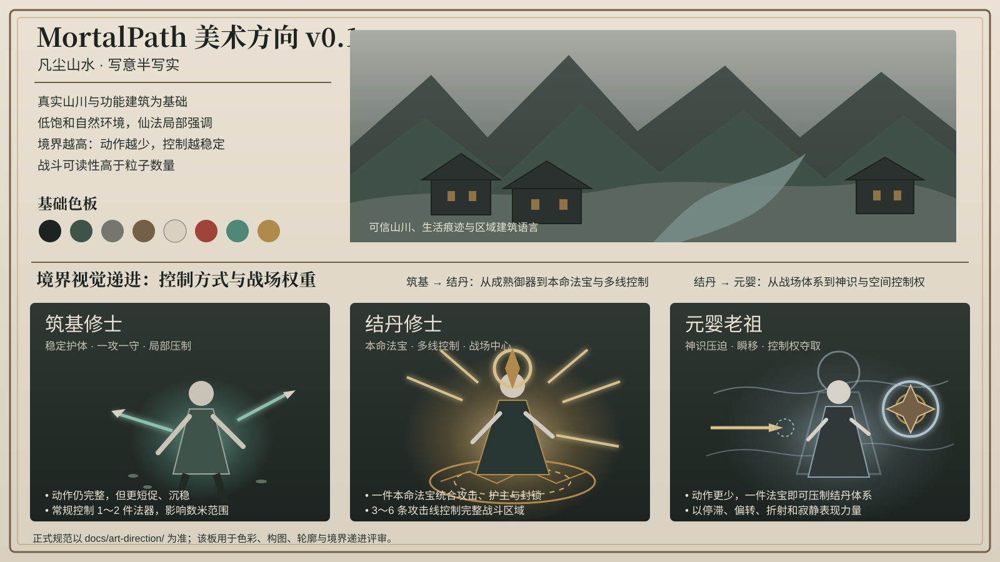

# MortalPath 美术方向

## 状态

- 基线版本：`v0.1`
- 状态：**M1～M3 生产基线已锁定**
- 风格名称：**凡尘山水·写意半写实**
- 技术形态：3D 角色与场景、固定正交斜俯视镜头、2.5D 构图
- 适用范围：Combat Proof、Realm Slice、Vertical Slice

这里的“锁定”表示：后续角色、场景、动画、VFX 与 UI 样本必须遵循本目录规范。只有在真实试玩、可读性测试或技术验证证明现有规则存在问题时，才通过版本化决策进行修改，不能由单个资产自行改变整体风格。

## 权威顺序

当不同材料发生冲突时，按以下顺序处理：

1. 本目录中的文字规范；
2. 经过评审的引擎内截图与 Style Frame；
3. `assets/art-guides/` 中的参考图；
4. 临时概念图、生成图与个人灵感图。

参考图负责确定构图、色彩、材质气质与力量层级，不负责提供最终文字。生成图中的小字、数值、称谓和图标不得直接进入游戏，所有正式文案必须人工校对并在 UI 中重新排版。

## 文档索引

- [`art-bible-v0.1.md`](art-bible-v0.1.md)：整体视觉方向、角色、场景、光照、色彩、UI 与禁止项。
- [`realm-visual-hierarchy.md`](realm-visual-hierarchy.md)：筑基、结丹、元婴之间的动作、法器、场域与压制差异。
- [`asset-production-spec.md`](asset-production-spec.md)：模型、材质、动画、VFX、UI、目录和性能基线。
- [`art-review-checklist.md`](art-review-checklist.md)：每个美术资产进入主分支前的验收标准。
- [`production-plan.md`](production-plan.md)：从概念定稿推进到 M3 垂直切片的制作顺序。

## 参考板

该图锁定的内容：

- 山川、村落、宗门与坊市建立在可信的自然和建筑基础上；
- 角色采用东方半写实比例，服饰克制且具有身份差异；
- 环境以低饱和自然色为主，仙法只在施放时形成局部强调；
- 境界越高，动作越少、控制越稳定、战场影响越强；
- 筑基、结丹、元婴必须形成清晰递进，而不是仅增加粒子数量。

该图不锁定的内容：

- 图中生成文字、数值和界面布局；
- 具体人物、宗门、法宝和功法设定；
- 最终角色面部与服装细节；
- 最终技能颜色、形状和动画时长。
